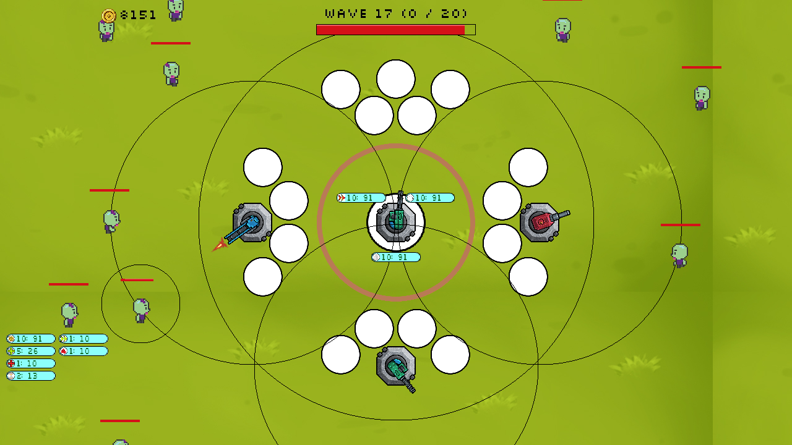
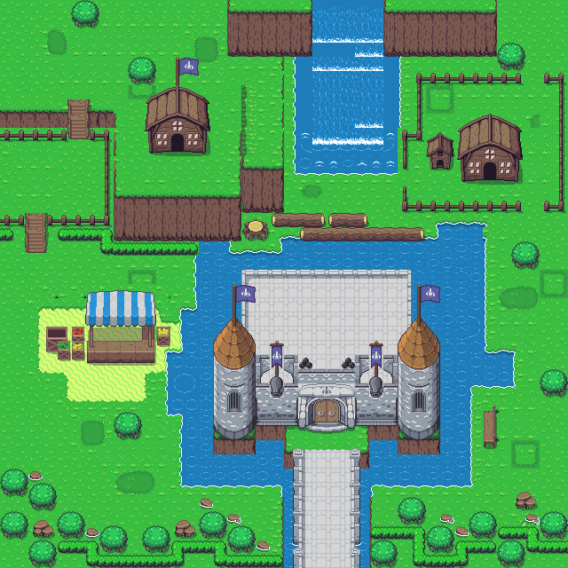
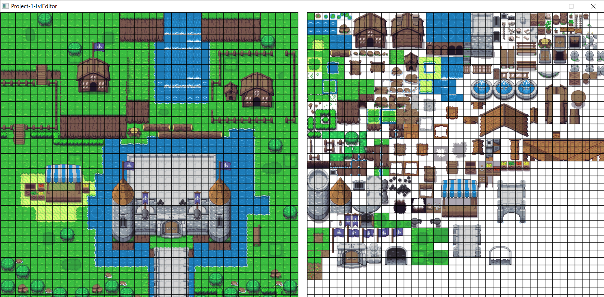
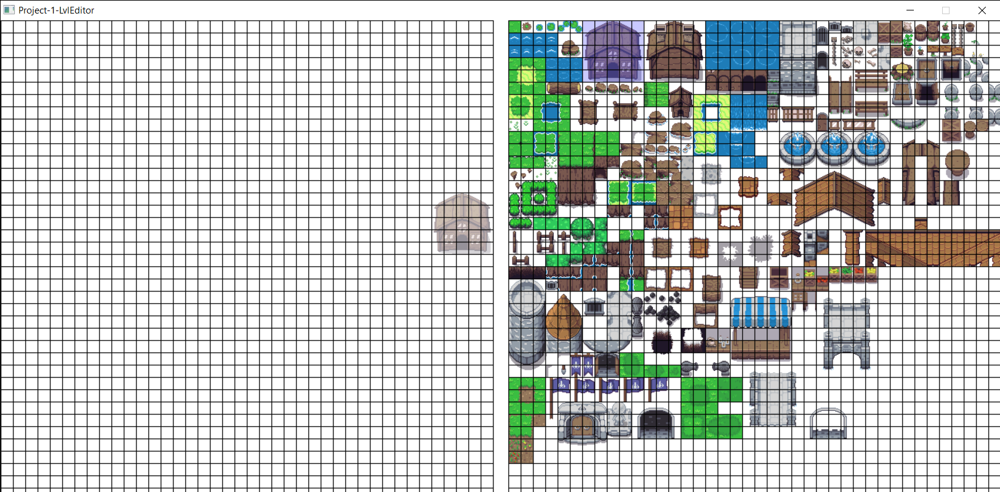

# C++ Portfolio
I have started to save projects that I have been working on.
## 
Tower Defence Game

Features endless waves of multiple enemy types. Boss waves with increased danger and reward. Unlock and upgrade extra Towers. 

## 
Multi-Layered Map Editor

 

Load a spritesheet and create maps with multiple layers. Select a square grid of tiles and draw them all to the map at once.

