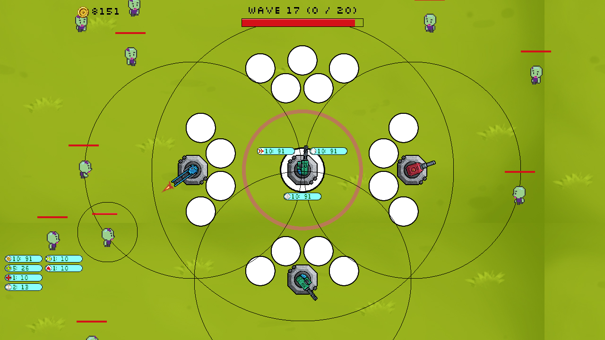
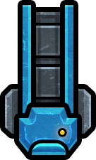
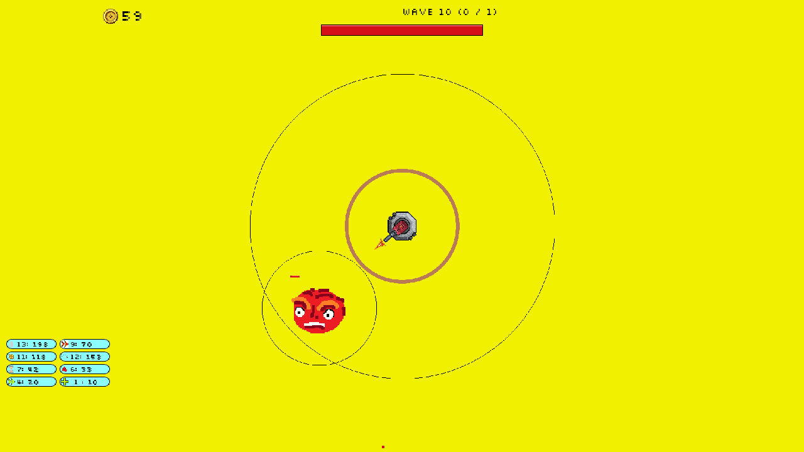

# 
TowerDefence

## 
About

A simple Tower Defence game. Tap / Click to shoot the enemies.
The aim of this project is to work at quickly creating and implementing UI and game ideas. Developed using SDL2.
## 
Recently Added

Turret swapping, stats and animations

## 
Images

 

## 
Features

### 
Enemies

| Type | Image | Description |
|:---|:---:|:---|
| Regular |  | Approaches the base and attacks. Kill for coins. |
| Fast |  | Faster than a regular enemy. |
| Heavy |  | Tougher, with higher HP than a regular enemy. |
| Bosses |  | Bigger, Stronger, Zombier. |
### 
Enemy Upgrades

| Type | Image | Description |
|:---|:---:|:---|
| SpawnRate |  | Decrease enemy spawn delay. |
| EnemySpeed |  | Increase enemy movement speed. |
| maxEnemies |  | Increase max enemies alive at once. |
### 
Base Upgrades

| Type | Image | Description |
|:---|:---:|:---|
| CoinDrop |  | Increases coins dropped by enemies by +100%. |
| MaxHP |  | Increase Max HP. |
| regenHP |  | Increase HP Regen. |
### 
Turrets

| Type | Image | Description |
|:---|:---:|:---|
| AutoGun |  | Fast, Cheap, Reliable. |
| Rocket |  | AoE, Increased Ranged. |
| Laser |  | Slow, Powerful, Expensive. |
### 
Turret Upgrades

| Type | Image | Description |
|:---|:---:|:---|
| Dmg |  | Increases the damage of the tower by 1. |
| AutofireRate |  | Increase tower Autofire rate. |
| fireRange |  | Increase tower firing range. |

## 
Build

Link + compile with SDL2

### 
Old Gameplay Images

 

 

