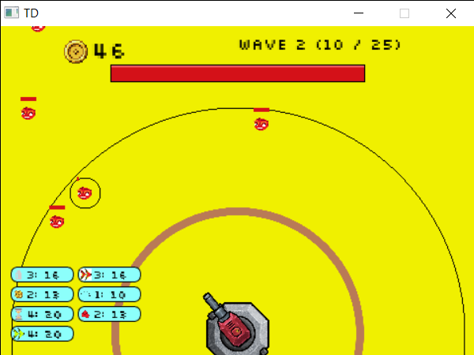
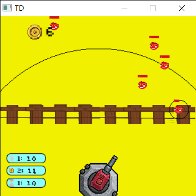

# TowerDefence - Readme
## About
A simple Tower Defence game. Tap / Click to shoot the enemies.
The aim of this project is to work at quickly creating and implementing UI and game ideas.

## Images
 

## Features
### Enemies
| Type | Image | Description |
|:---|:---:|:---|
| Regular |  | Approaches the base and attacks. Kill for coins. |
| Fast |  | Faster than a regular enemy. |
| Heavy |  | Tougher, with higher HP than a regular enemy. |
| Bosses |  | Bigger, Stronger, Zombier. |
### Upgrades
| Type | Image | Description |
|:---|:---:|:---|
| Dmg |  | Increases the damage of the tower by 1. |
| CoinDrop |  | Increases coins dropped by enemies by +100%. |
| SpawnRate |  | Decrease enemy spawn delay. |
| EnemySpeed |  | Increase enemy movement speed. |
| AutofireRate |  | Increase tower Autofire rate. |
| fireRange |  | Increase tower firing range. |
| maxEnemies |  | Increase max enemies alive at once. |
| regenHP |  | Increase HP Regen. |

## Build
Link + compile with SDL2

### Old Gameplay Images
 
